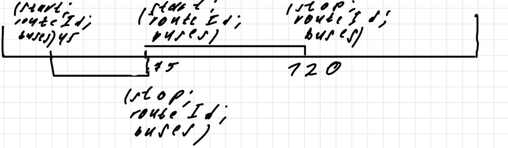

#### ТЗ Для Лёни
### Формат входных данных
## Формат дорог
Файл со строками, описывающими дороги, ID точек представлены в виде целых чисел, данные идут через пробел

`ID стартовой точки, ID конечной точки, расстояние между ними`

дорога двусторонняя
## Формат первичного расписания
Файл представлен строками, описывающими рейсы, данные идут через пробел

`ID стартовой точки, ID конечной точки, номер рейса, количество пассажиров`
## Требования к алгоритму
У нас есть 30 автобусов вместимостью 100 человек и 10 автобусов вместимостью 50 человек, на выходе нужно представить словарь, ключами в котором будут целые числа (минуты), выглядеть это всё должно следующим образом:

Каждый элемент словаря является массивом, внутри которого элементы тоже являются словарями (или структурами мне похуй главное чтобы ключи такие были).
Каждый такой элемент внутри массивы имеет следующую структуру:

* Флаг о том, начало это или конец рейса
* Уникальный целочисленный идентификатор рейса
* Ключ с именем `buses`, который является массивом целых чисел, т.е. идентификаторов автобусов.
* Точка отправления
* Точка назначения
  
## ПРИМЕР ВЫХОДНЫХ ДАННЫХ
```python
start1 = {'isStart': True,
          'routeId': 100,
          'buses': [5, 6, 10],
          'startPoint': 100,
          'stopPoint': 150,
          'passengers': 200
          }
stop1 = {'isStart': False,
         'routeId': 100,
         'buses': [5, 6, 10],
         'startPoint': 100,
         'stopPoint': 150,
         'passengers': 200
         }
start2 = {'isStart': True,
          'routeId': 150,
          'buses': [15, 20],
          'startPoint': 200,
          'stopPoint': 250,
          'passengers': 100
          }
stop2 = {'isStart': False,
         'routeId': 150,
         'buses': [15, 20],
         'startPoint': 200,
         'stopPoint': 250,
         'passengers': 100
         }
exampleTimeDict = {
    45: [start1],
    70: [stop1, start2],
    120: [stop2]
}
```
Если можно сделать без дублирования данных в элементах с флагом `isStart: False`, т.е. оставить там только идентификатор рейса, то так будет лучше, но необязательно.

## Предположения по запросам
Нужно уметь пересчитывать оптимальное распределение автобусов в случае, если рейс заканчивается раньше или позже.
В случае, если у нас неожиданный рейс я думаю можно держать в уме, что кейс первоначально про уменьшение количества используемых автобусов, а это значит, что будет свободный автобус.
Автобус после окончания рейса стоит у гейта или на стоянке, не думаю, что он может стоять прямо в поле

Время рейса складывается из следующих вещей - 10 минут посадка пассажиров, воемя в пути (длиа в метрах/скорость автобуса, скорость ~8.4 м/с) и 5 минут высадка пассажиров. Время самого рейса может меняться

## Предложения для формата запросов
Обновление времени

`флаг запроса номер рейса новое время работы рейса`

`флаг запроса номер рейса новое время начала`

Первый для случая, когда изменяется время самого рейса, второе для случая, когда откладывается начало

Также должна быть возможность снять конкретный автобус с рейса (опционально думаю, они говорили про то, что всё будут делать руками в таком случае это можно сделать на фронте или на бэке)

## Новый рейс

`номер рейса, ID стартовой точки, ID конечной точки, количество пассажиров`
